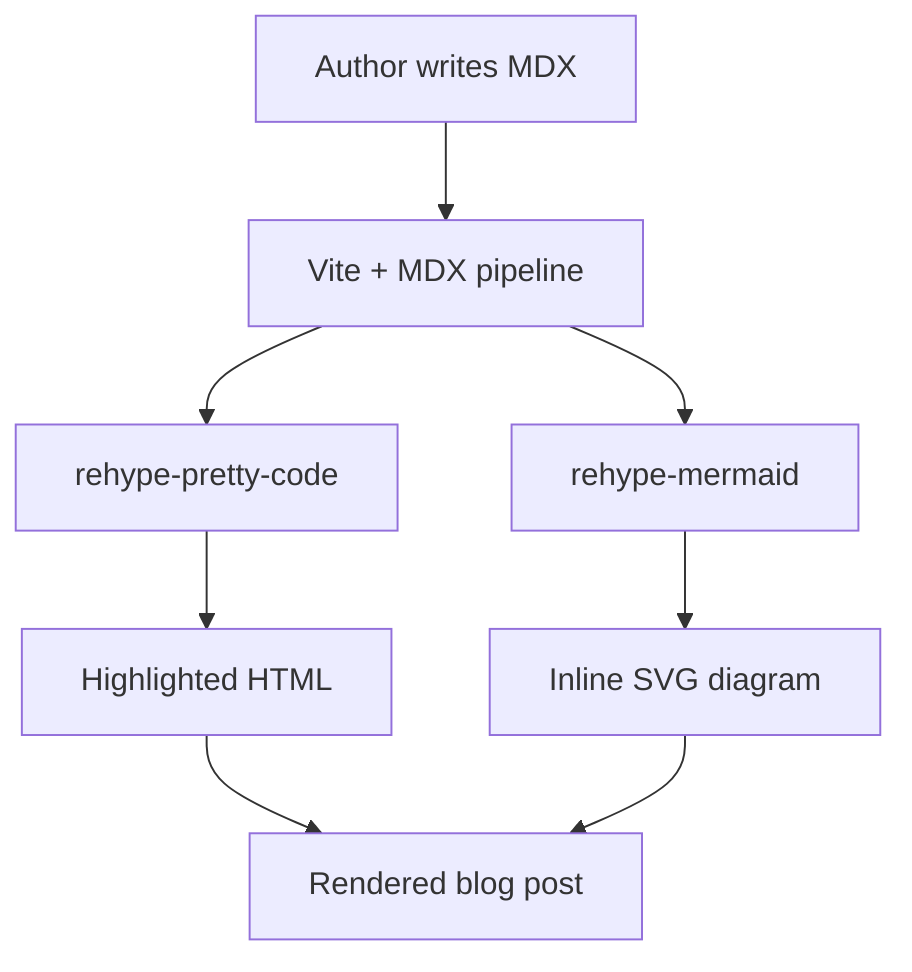

{/* 
  NEW POST TEMPLATE (MDX)
  1) Copie este arquivo para: src/content/posts/<seu-slug>.mdx
  2) Ajuste o frontmatter obrigatório.
  3) Não repita slug de outro post.
*/}

<p className="article-intro">
  Parágrafo de abertura com contexto do problema, tese e direção do texto.
  Este bloco usa a classe de intro já estilizada no projeto.
</p>

## Seção principal (H2)

Texto normal com **negrito**, *itálico* e `inline code`.

### Subseção (H3)

- lista não ordenada
- com itens curtos
- e foco em legibilidade

1. lista ordenada
2. com passos objetivos
3. sem excesso de detalhe

> Citação editorial para pausa de leitura e síntese.

---

## Tabela (GFM)

| Campo | Exemplo | Observação |
| --- | --- | --- |
| categoria | Arquitetura | Use as categorias já existentes quando possível |
| readingTime | 7 min de leitura | Texto livre, padrão editorial atual |
| date | 16 de março de 2026 | Formato PT-BR suportado pelo parser |

## Task list (GFM)

- [x] argumento principal definido
- [x] subtítulo alinhado à tese
- [ ] revisão final de estilo

## Bloco de código com highlight

Use metadata para destacar linhas e nomear o bloco:

```tsx title="types/post-meta.ts" {4,8}
type PostMeta = {
  title: string;
  slug: string;
  category: string;
  subtitle: string;
  excerpt: string;
  date: string;
  readingTime: string;
  author: string;
};
```

Também funciona highlight por trecho:

```ts
function resolvePost(slug: string) {
  const post = postsBySlug[slug];
  if (!post) return null;
  return post;
}
```

## Links e imagem

Link interno: [Voltar para home](/)

Link externo: [Documentação MDX](https://mdxjs.com/)


---

## JSX livre (capacidade MDX habilitada)

{/* Exemplo de componente inline local ao próprio arquivo MDX */}
export const InlineCallout = ({ title, children }) => (
  <aside
    style={{
      border: "1px solid rgba(214, 182, 128, 0.35)",
      padding: "16px 18px",
      margin: "24px 0",
      background: "rgba(214, 182, 128, 0.08)",
    }}
  >
    <strong style={{ display: "block", marginBottom: 8 }}>{title}</strong>
    <div>{children}</div>
  </aside>
);

<InlineCallout title="Nota técnica">
  Você pode compor JSX diretamente no MDX para blocos customizados de conteúdo.
</InlineCallout>

{/* Também é possível renderizar HTML válido quando necessário */}
<details>
  <summary>Expansível com HTML/JSX</summary>
  <p>Use com moderação para não quebrar o ritmo editorial.</p>
</details>

## Mermaid (diagramas em markdown)

Escreva blocos `mermaid` diretamente no MDX:



## Encerramento

Feche o artigo retomando a tese e apontando implicações práticas para engenharia,
craftsmanship ou IA aplicada.
